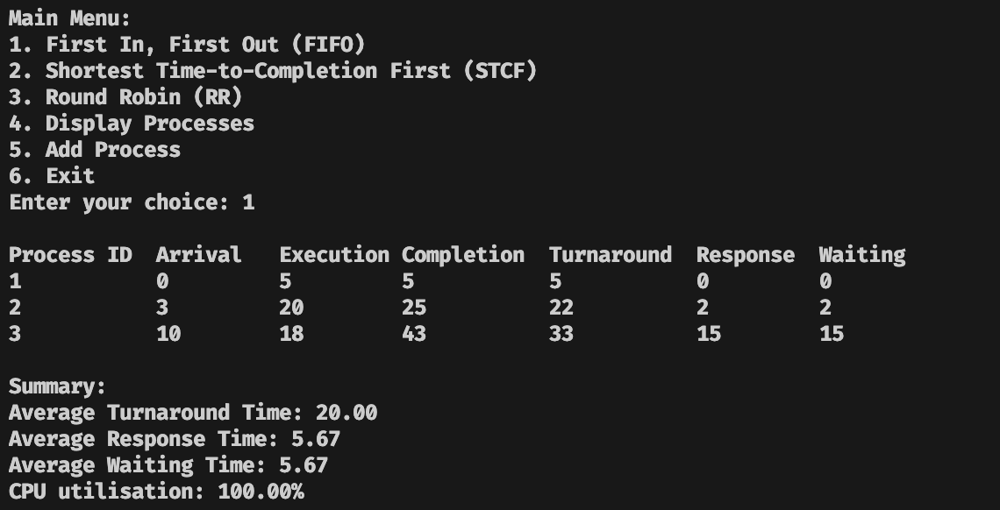
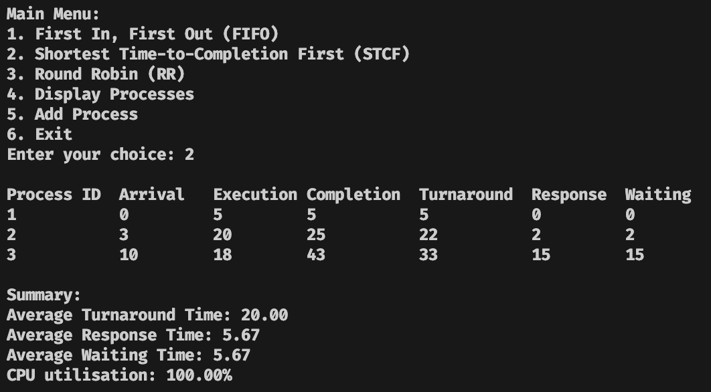
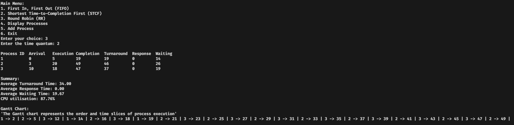
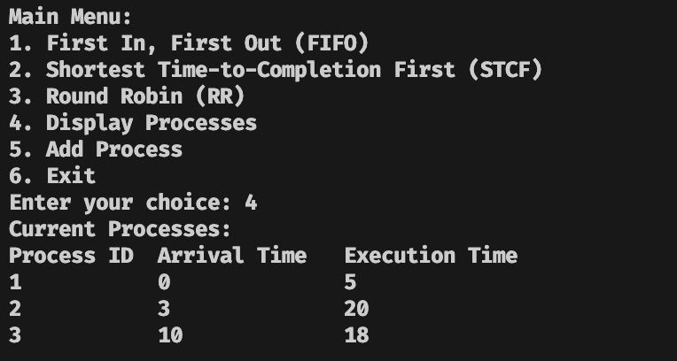

# Process Scheduler Simulator

## 🚀 Overview

A command-line application that simulates and compares different CPU process scheduling algorithms. This tool helps visualize how operating systems manage process execution by implementing three classic scheduling algorithms:  FIFO (First In, First Out), STCF (Shortest Time-to-Completion First), and Round Robin.  Perfect for understanding OS concepts, comparing algorithm efficiency, and analyzing scheduling metrics like turnaround time, response time, and waiting time.

## 🖼️ Screenshots

Below are screenshots of the application in the same order as the main menu options:

- Add / Input Processes


- FIFO (First In, First Out)



- STCF (Shortest Time-to-Completion First)



- Round Robin (RR)



- Display Processes



## 🧠 Tech Stack

- **Python 3.x** - Core programming language
- **Object-Oriented Design** - Modular architecture with Process and Scheduler classes
- **Terminal-based UI** - Interactive command-line interface

## 📊 Features

- **Three Scheduling Algorithms**:
  - **FIFO (First-Come, First-Served)**:  Non-preemptive scheduling based on arrival order
  - **STCF (Shortest Time-to-Completion First)**: Preemptive scheduling that prioritizes processes with shortest remaining time
  - **Round Robin**: Time-quantum based preemptive scheduling with configurable time slices

- **Interactive Process Management**:
  - Add processes dynamically with custom Process ID, arrival time, and execution time
  - Input validation ensures data integrity
  - View all processes in a formatted table

- **Comprehensive Metrics**:
  - Response Time - Time from arrival to first execution
  - Turnaround Time - Total time from arrival to completion
  - Waiting Time - Time spent waiting in the ready queue
  - CPU Utilization - Percentage of CPU active time
  - Average statistics across all processes

- **Visual Gantt Chart** (for Round Robin):
  - Timeline visualization showing process execution order and time slices

## 📈 Results

- **Algorithm Comparison**: Compare scheduling efficiency across different workloads
- **Performance Metrics**: Calculate average turnaround time, response time, and waiting time for process sets
- **CPU Utilization**:  Measure system efficiency and identify idle time
- **Real-time Analysis**: See immediate results after running each scheduling algorithm

## 🧪 How to Run

### Prerequisites

- Python 3.x installed on your system

### Steps

1. **Clone the repository**

   ```bash
   git clone https://github.com/AhmedIkram05/process-scheduler.git
   cd process-scheduler
   ```

2. **Navigate to the application directory**

   ```bash
   cd "Process Simulator"
   ```

3. **Run the application**

   ```bash
   python3 ProcessSchdulerApp.py
   ```

4. **Using the Application**
   - Enter the number of processes when prompted
   - For each process, provide:
     - **Process ID**:  Unique identifier (e.g., P1, P2, Process1)
     - **Arrival Time**:  When the process arrives (0 or positive integer)
     - **Execution Time**: CPU time required (positive integer)
